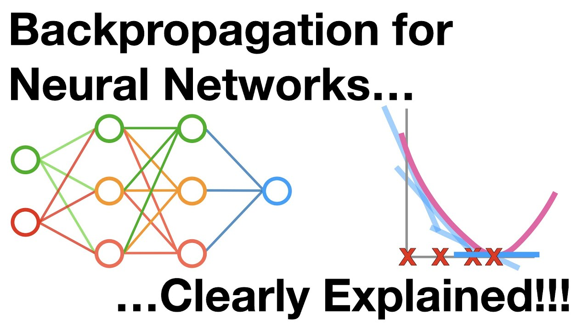

# Neural Networks fundamentals

This section is kind of huge since it is meant to introduce you to the topic of Neural Networks (NN). Of course, if you already understand how they work, you can skip it. We will only talk about the fundamentals and not mention any type of extra complexity like Convolutional nor Recurrent Neural Networks (CNN and RNN, respectively).

## Perceptrons: the basic units 

Perceptrons are the basic building units of a NN. Perceptrons are structures that receive $n$ numerical inputs $x_i$. Each perceptron has its own $n$-weights, one bias and then an activation function. The perceptron multiplies the inputs by the $n$ different weights $w_i$ and then adds the bias. The result of this combination, a single number, goes through an activation function. There are several types of activation functions and we will see a couple of the most common ones. 

The perceptron structure:
- inputs $x_i$
- weights $w_i$
- bias $b$
- activation function $f$
- output: $f(w_i\cdot x_i+b)$

Weights and bias can be interpreted as a system of knobs that we can manipulate to optimize our model — like when we try to tune our radio by turning the knobs to find the desired frequency.
This two elements are parameters of the network, so it will be subject to the change generated by the rotation of the imaginary knobs. Since the weights are multiplied by the input, they affect the magnitude of the latter. The bias, on the other hand, is added to the whole expression, so it will move the function in the dimensional plane (shifting it up and down).

[Link to video](https://www.youtube.com/watch?v=OFbnpY_k7js)

## A simple example of a full Neural Network

Once a perceptron is understood, a NN is just a bunch of perceptrons connected to the inputs, outputs or to each other. The hard part about them is their architecture. There are several ways to design their structure and the performance will greatly depend on this. The next video will explain to you how the inputs get converted into predictions of a simple problem.

[Link to video](https://www.youtube.com/watch?v=CqOfi41LfDw)

## How does a Neural Network learn?

Everytime we create a NN, we initialize it with random values, unless we are using some previosly trained NN that we want to use as our basis. Once these initial values are set, the process to update these values are actualized by following a very simple mathematical principle, minimization. For each problem we have to define our loss function, which modelizes our error in terms of the output of the NN. 

For example, if the task is a regression task, then a possible loss function would be the mean squared error. Now, the minimization of this error function can be achieved by taking derivative of their values and putting them to zero. This is, a gradient descent approach. Since perceptrons give functions of combinations, once you concatenate several of them, you will get a derivative of functions of combinations of functions of combinations of functions... etc. Therefore, when taking derivatives, you will encounter that the only possibility to do this is by applying the chain rule. 

This chain rule has been given a fancy name in the NN framework... _backpropagation_. The same way as evaluating the NN for a given input is called _forward propagation_. Two fancy names for very simple mathematical ideas.

You can get more details and an example about this in the next video.

[Link to video](https://www.youtube.com/watch?v=IN2XmBhILt4)

[Link to video](https://www.youtube.com/watch?v=iyn2zdALii8)

[Link to video](https://www.youtube.com/watch?v=GKZoOHXGcLo)

In case you don't remember what gradient descent is, here you have one of the best youtube channels ever: 3Blue1Brown .

[Link to video](https://www.youtube.com/watch?v=IHZwWFHWa-w)

## Activation functions

We have talked about the activation function, but we have not explained to you what they are. Activation functions are called like this because the first example of these types of functions that was proposed was a Heaviside function (also known as step function). They determine whether some perceptron is activated or not, since the heaviside only takes values 0 or 1. This function is useless for NN since its output is only 1. One of the most common one is as variation called the Rectified Linear function (ReLU), given by:

$$
f(x) = \begin{cases} 
0 & \text{if } x < 0 \\ 
x & \text{if } x \geq 0 
\end{cases}
$$

There are a ton of other activation functions and a whole lot of issues if one wants to do Neural Networks in production like the _dying ReLU_ and _vanishing gradient problems_.

Here you have a quick expannation on the subject.

[Link to video](https://www.youtube.com/watch?v=s-V7gKrsels)

