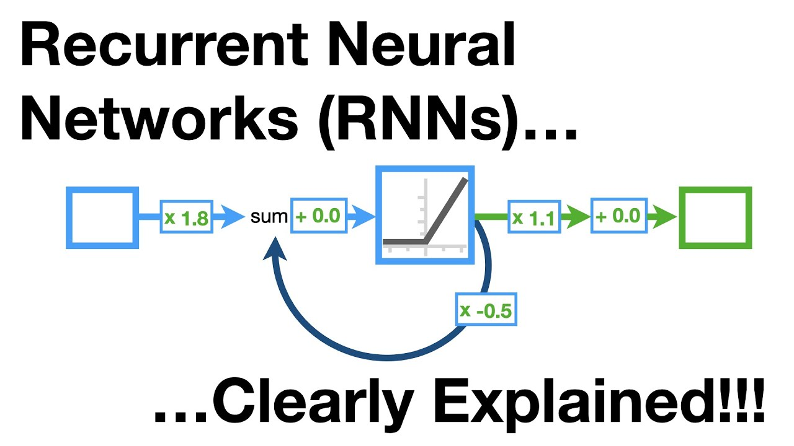
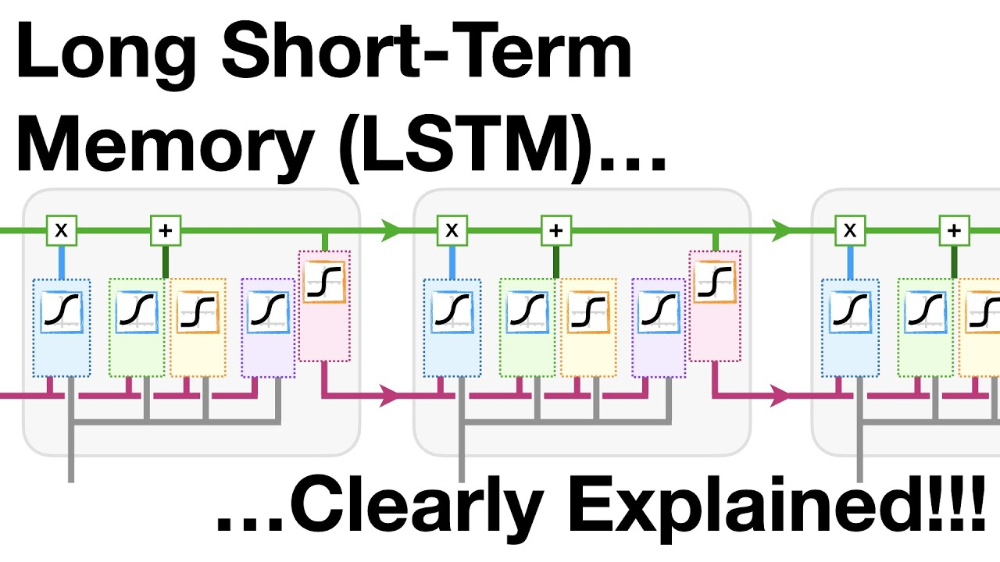
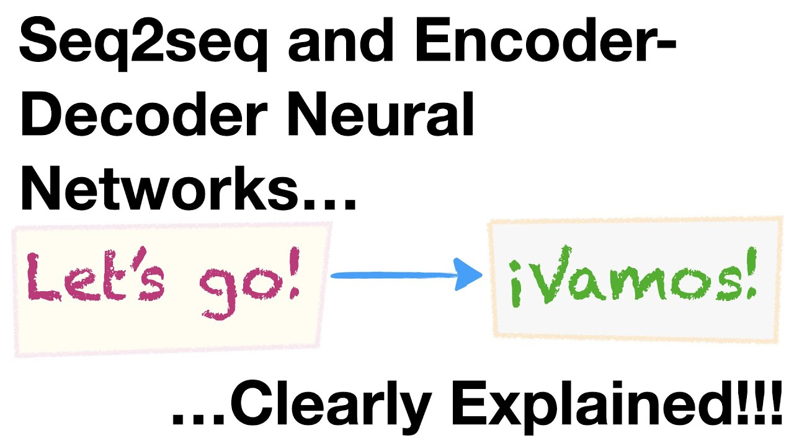
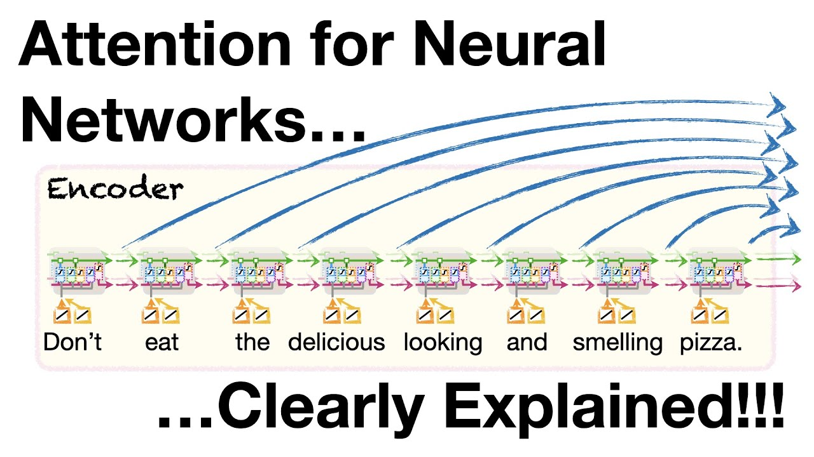

# NN Intermediate: towards Transformers 🧠⚡

In this section, we explore the evolution of neural network architectures leading up to the development of the Transformer model. Each architecture brings us closer to solving complex sequence-to-sequence tasks common in natural language processing.

## Recurrent Neural Networks (RNN) 🔄🧠

Recurrent Neural Networks (RNNs) are a foundational architecture in sequence modeling. They are designed to handle sequences of data by processing one element at a time while retaining a 'memory' of what has been processed through hidden state vectors. This memory is used to influence the processing of the next elements in the sequence.

[Link to video](https://www.youtube.com/watch?v=AsNTP8Kwu80)

## Long Short-Term Memory (LSTM) 🕒🧠

Long Short-Term Memory networks (LSTMs) are an extension of RNNs that can learn long-term dependencies more effectively. They achieve this with a more complex internal structure consisting of gates that regulate the flow of information. These gates control the retention and forgetting of information in the hidden state over time.

[Link to video](https://www.youtube.com/watch?v=YCzL96nL7j0)

## seq2seq Encoder-Decoder 🔄🔁

The seq2seq, or sequence-to-sequence, model is designed for tasks that involve converting sequences from one domain to another, like translation. It consists of two main components: an encoder that processes the input sequence and a decoder that generates the output sequence.

[Link to video](https://www.youtube.com/watch?v=L8HKweZIOmg)

## The Attention Mechanism 👁️🎯

The Attention Mechanism allows the model to focus on different parts of the input sequence when predicting each part of the output sequence, mimicking the selective nature of human focus. It greatly improves the performance of seq2seq models by creating a direct connection between the context and the current target word being predicted. Essentially, the Attention Mechanism links the inputs to each step of the Decoder, allowing it to access these values directly.

[Link to video](https://www.youtube.com/watch?v=PSs6nxngL6k)
