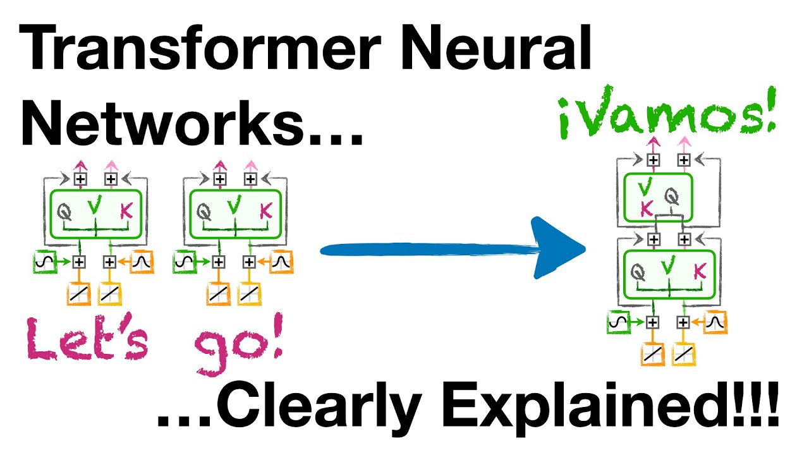
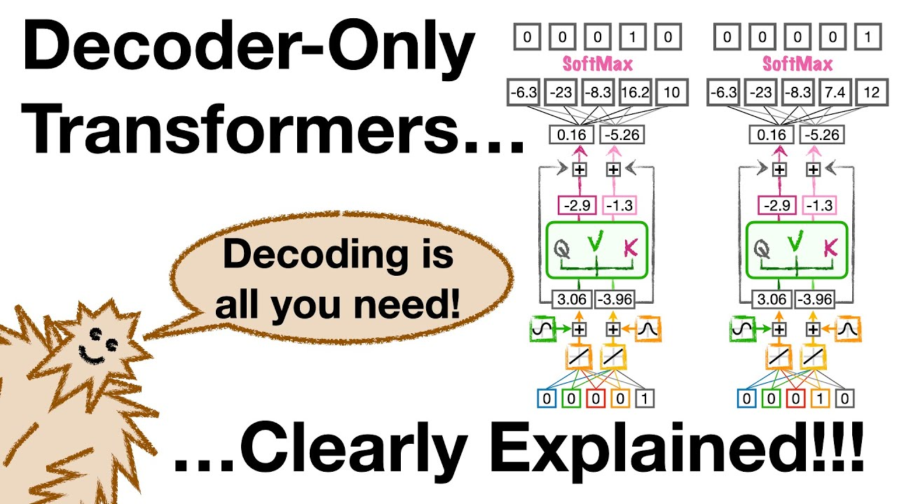

# Embeddings

Embeddings are the central piece of Large Language Models. They are the reason of their success, and the most important concept to understand. Since you already know that Neural Networks only work with numbers, it is easy to understand that the first piece of the puzzle is tokenization. But how do we convert a bunch of tokens into a **meaningful** vector representation that contains the meaning nuances of the context of the sentence?

The answer: **Transformers**

# The building blocks of Large Language Models: Transformers ⚙️

Transformers are the pinacle structure to create the Neural Networks that constitute these Large Language models. 

At its core, a transformer model consists of two primary components: the encoder and the decoder. 

- **Encoders**: process the input sequence and create a set of representations that capture the nuances of the input data
- **Decoders**: take these representations and generates an output sequence.

An essential feature of transformers is the use of **attention mechanisms**, which allow the model to focus on different parts of the input sequence when producing the output, akin to how a human pays more attention to specific words while reading a sentence. This mechanism is pivotal in handling long-range dependencies in the data.

**Positional encoding** is another vital component that provides the model with information about the order of the sequence. 

## Encoder Structure 📈🔍

The encoder of a transformer model is designed to parse the input sequence and convert it into a higher-dimensional space where relationships between the data points can be more easily discerned. It is typically composed of a stack of identical layers, each containing two main sub-layers:
- **self-attention mechanism**
- **position-wise fully connected feed-forward network**

## Self-Attention Mechanism 👀💡

The self-attention mechanism is what allows a transformer to consider the entire input sequence simultaneously and to determine the relevance, or "attention" that each element of the input should receive when computing a representation of a particular word.

In essence, it computes a score that signifies how much focus should be put on other parts of the input when encoding a certain part.

Self-attention works by creating three vectors for each input token: 
- a query vector
- a key vector
- a value vector

The attention score is then computed by taking the dot product of the query with all keys, followed by a softmax operation to obtain the weights on the values.

## Positional Encoding 🌐📍

Positional encoding is a technique used to give the model information about the relative or absolute position of the tokens in the sequence. Since the self-attention mechanism does not inherently consider the order of the tokens, positional encoding is added to the input embeddings at the bottom of the encoder stack.

The original transformer paper proposed using sine and cosine functions of different frequencies to encode the positions. These functions provide a unique position signal to each token which can be scaled and manipulated along with the token embeddings through the layers of the transformer, thus preserving the order information.

## Decoder Structure 📉🔎

The decoder in a transformer model mirrors the encoder with additional components specific to its role in generating the output sequence. It also consists of a stack of identical layers, but each layer has an additional sub-layer for encoder-decoder attention that helps the decoder focus on appropriate segments of the input sequence.

The self-attention mechanism within the decoder allows each position in the decoder to attend to all positions in the decoder up to and including that position. Attention masks ensure that the predictions for a given position can depend only on the known outputs at positions before it, preserving the auto-regressive property.

## Encoder-Decoder Attention 🔄🔗

The encoder-decoder attention layer within the decoder acts as a bridge between the encoder and decoder. It allows the decoder to focus on different parts of the input sequence – an aspect critical for tasks like translation where the relevance of input and output segments can vary significantly.

This attention mechanism takes the output of the last layer of the encoder as its key and value, while the queries come from the previous decoder layer. This allows every position in the decoder to attend over all positions in the input sequence, which is crucial for accurate prediction and alignment between the input and the generated output.

These components work in concert within the transformer architecture, enabling it to handle a variety of complex sequence-to-sequence tasks with remarkable effectiveness.

[Link to video](https://www.youtube.com/watch?v=zxQyTK8quyY)

[Lint to video](https://www.youtube.com/watch?v=bQ5BoolX9Ag)