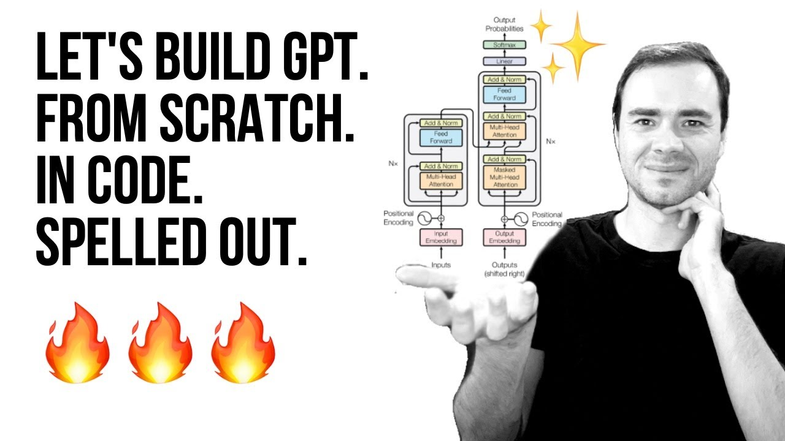

#  A Simple Example

This section offers a distilled overview of the key stages in the workflow of Large Language Models (LLMs), specifically highlighting the transformative role of the Transformer architecture.

## Key Concepts of Transformers:

1. **Tokenization**: Text is converted into tokens, where each token corresponds to a word or a part of a word, depending on the tokenizer used.

2. **Embedding and Positional Encoding**: Each token is embedded into a vector that encodes its meaning and is augmented with positional encoding to maintain the order of the sequence.

3. **Attention Mechanism**:
    - The Transformer's attention mechanism uses three types of vectors for each token: query (Q), key (K), and value (V). These vectors are generated by transforming the input embeddings.
    - **Query Vectors** represent the token that is currently being processed.
    - **Key Vectors** correspond to the tokens that the query is compared against to establish relevance.
    - **Value Vectors** contain the information from each token that should be passed on if the token is deemed relevant.

    The attention mechanism computes a score by comparing each query with all keys. This score determines how much focus (or attention) the network should put on the corresponding values during the current processing step. High scores indicate high relevance, and thus, more attention.

4. **Synthesizing Meaning**:
    - Scores are normalized and used to create a weighted sum of value vectors. This sum is what the model considers as the 'context' for a given token.
    - By taking into account the context of each token, the Transformer can generate a response or a continuation that is contextually relevant to the input sequence.

The Transformer’s ability to dynamically assign importance to different parts of the input text allows LLMs to generate text that is not only grammatically correct but also contextually coherent and nuanced.

Appart from this remainder, this is just an excuse to give you one of the best presentations on how an LLM works

[Link to video](https://www.youtube.com/watch?v=kCc8FmEb1nY)
