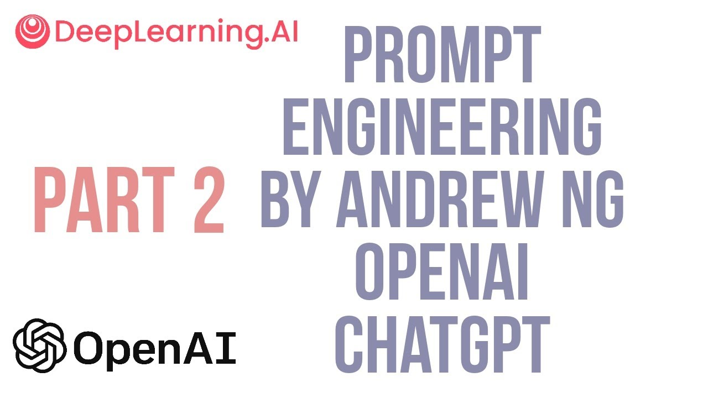
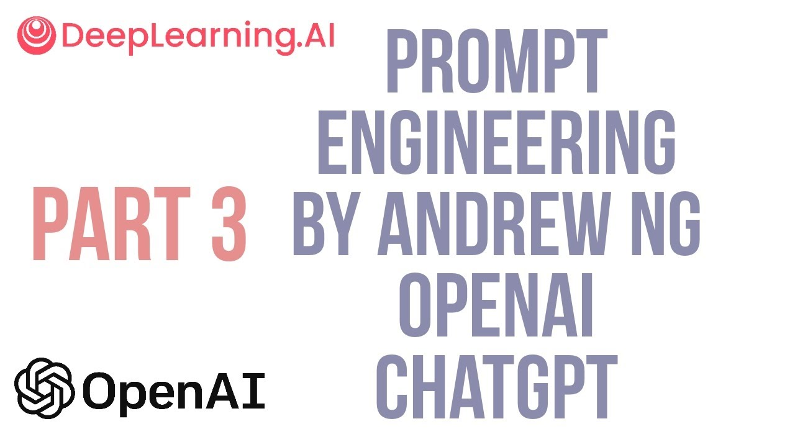

# Basic Principles of Effective Prompting 📝

What is prompt engineering? you may wonder... prompt engineering is a set of guidelines and tactics or techniques that function as guardrails that control the behaviour of your Large Language Models. 

Recall that Large Language Models are trained to predict words. Therefore, they do not contain facts per se, but probabilities. This means that in order to squeeze the best behaviour out of them, you need to get a grasp on how to effectively guide them to a much better performance.

## Clear and Specific Instructions 🔍
- **Be precise**: vague prompts can lead to ambiguous results.
- **Length unfortunately matters**: a longer prompt can provide vital context.
### Using Delimiters ✂️
Use symbols like triple backticks to segment prompts. This will prevent prompt injections since it will separate the user input clearly.
```python
"""
Summarize the text between triple backticks: 

```The quick brown fox jumps over the lazy dog.```
"""
```

### Structured Output 📊
You can request the model to output in predictable formats like JSON. This facilitates parsing and further processing, specially when using an LLM as part of a more complex software.
```python
"""
Provide three fictional book titles with authors and genres in JSON format.
"""
```

### Checking Conditions ✔️
Have the model confirm assumptions before proceeding. This will avoids errors in task completion.
```python
"""
If the text contains a list of ingredients, rewrite them as bullet points; otherwise, state 'No list present.'
"""
```
### Few-Shot Prompting 🎯
Offer examples to guide the model's responses. This helps establishing a response pattern.
```python
"""
Here's how to apologize: 'I'm sorry for being late.' Now, apologize for forgetting an anniversary.
"""
```

## Give the Model Time to Think 🕒🧠

- **Break tasks into steps**: simplifies complex reasoning for the model. For example, for a math problem, ask the model to "explain each step" in solving an equation.

### Specifying Steps for Task Completion 📝
Detail each part of the task for clarity. This improves accuracy of the model's output.
```python
"""
Summarize the text, then translate the summary into Spanish, and finally, identify the main verbs in the Spanish summary.
"""
```

### Working Out Solutions 🧩
Encourage the model to reason before answering. This leads to more thoughtful and accurate responses.
```python
"""
Solve the equation step by step before confirming if the student's answer of x=3 is correct.
"""
```

## Model Limitations and Hallucinations 🚧

### Understanding Model Limitations 🛑
Recognize the model's capacity for error since it can't perfectly recall all learned information.
```python
"""
Explain why the model might mistake fictional information for fact.
"""
```

### Reducing Hallucinations 🔍
Use direct quotes from text to ground the model's responses. This ensures answers are traceable to a source.
```python
"""
Based on the text, 'Romeo and Juliet is a tragedy by Shakespeare,' explain the theme of the play using direct quotes.
"""
```


<br>
<br>


## Andrew NG

We will closely follow a course from Stanford's Proffessor Andrew NG on prompt engineering. He is a renowned expert in the AI field, while also being one of the best references available on youtube and other teaching platforms. Here you have the first part of the course.



[Link to video](https://www.youtube.com/watch?v=Dme7TqCyIqs)


### Prompt workflow

It is rarely the case that you get the prompt first try. These types of generative models require a lot of trial-error attempts, so getting the right prompt takes a couple of iterations. Here is an example on how to tune these prompts for our specific tasks.



[Link to video](https://www.youtube.com/watch?v=GD3DCPeIaYU)

