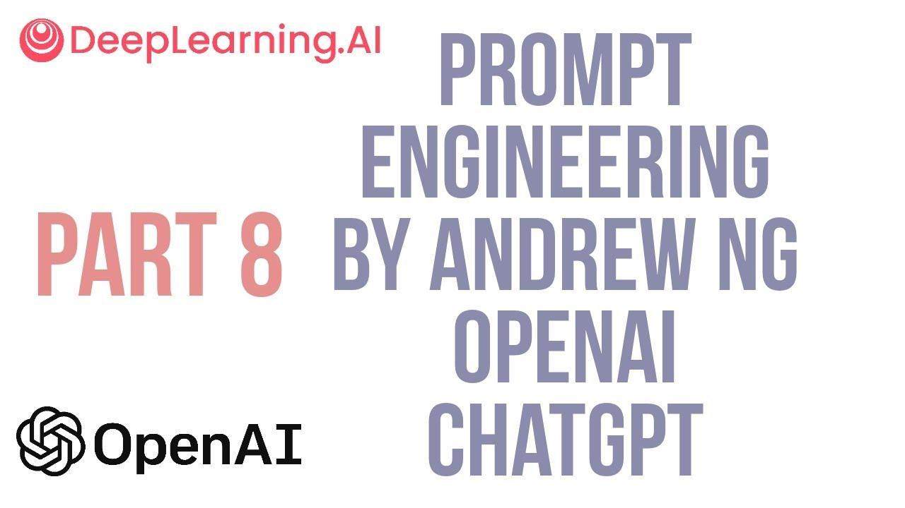

# Role-Playing in Prompt Engineering 🎭

Role-playing involves instructing the language model to assume a specific character or identity. It enhances the creativity and specificity of responses.
```py
"""
Assume the role of a fitness coach and provide a weekly exercise routine for beginners.
"""
```

### Enhancing Context and Accuracy 🎯
By adopting a role, the model's responses can become more contextually rich and nuanced. Particularly important when you want the chatbot to perform a very specific task. It can, and should, also be used to enhanced the style by using worlds like `professional`, `expert`, `well-trained machine`, etc. 
```py
"""
As a leading expert historian, summarize the impact of the Renaissance on modern education.
"""
```

### Transmitting writting style 📖
Role-playing can be used to create interactive narratives where the model plays a character in a story.
```py
"""You are a detective in a noir thriller. Describe your next steps after finding a mysterious clue at the crime scene.
"""
```

### Educational Scenarios 👩‍🏫
Adopting the persona of an expert in a field can create engaging educational content.
```py
"""
Pretend to be a science teacher explaining the water cycle to third graders.
"""
```

### Customer Service Simulation 💼
Role-playing can simulate customer service scenarios, providing training for real-life interactions.
```py
"""
Act as a customer support agent and respond to an inquiry about a delayed flight.
"""
```

### Other use-cases

Of course, all of the above are just implementations of the same thing, instructing the LLM to take a persona and reply as that persona. This normally happens at the level of the system prompt, _and what is that?_ you may wonder. 

## Conversations 💬💬
When instructing the model to role-play, we are normally thinking in building some application that always works as if it were that role. This type of instruction is special since it should always be present in the process. It is indeed specially constructed in the chatGPT training. 

But in reality, what if we wanted the model to remember interactions. Up until now, we have always done single requests, but the power of these LLMs is to have some type of history of the conversation. This takes us to defining three roles for the messages:
- `system`: this is the message that tells chatGPT how to behave at every interaction. It is normally hidden from the user.
- `user`: every message sent by the user wil contain this flag to be identifiable as a human message.
- `assistant`: these are previous replies generated by the LLM.

For an explicit implementation of a chatbot doing role-play, we leave you with another Andrew NG video.




[Link to video](https://www.youtube.com/watch?v=kN_3CZ-iE1c)