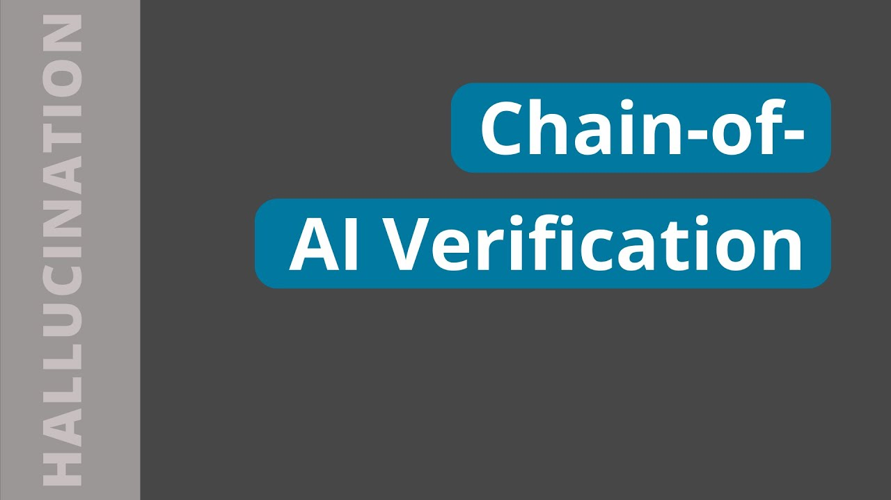

# Chain-of-Verification (CoVe) 🔗🔍✅

When dealing with Large Language Models (LLMs), a significant challenge, particularly in factual question and answering, is the issue of _hallucinations_. 

Hallucinations occur when the answer appears plausible but is factually incorrect. The method of chain of verification tries to deal with this issue in the following way:

1. **Initial Response Creation**
2. **Verification Question Generation**: Ask the model to create questions that fact-check the initial response. 
3. **Execute Verification**: The verification questions are _independently_ answered to minimize any potential bias. 
4. **Final Refined Answer Generation**: Based on the results of the verification process, a final refined answer is generated. 

This procedure is the backbone of the method. The implementation can be done in a couple of ways. The original proposals are the following, but feel free to come up with your own ones 😉:

- **Joint**: In this method, both the planning and verification steps are done jointly using a single prompt request made to the LLM. However, this method is not recommended as the verification result can be hallucinated and affected by bias.
    
- **2-Step**: In the first step, verification questions are generated, and in the second step, they are answered. All questions and answers are generated in batches.
    
- **Factored**: Instead of using one big response, it is better to answer each question separately. This way, the answers won’t be just copies of the baseline response. This approach also helps avoid confusion between different questions, and it might be able to handle more verification questions, even though it could be computationally expensive.
    
- **Factored + Revise**: After we get the answers to the verification questions, the CoVe pipeline needs to check if the answers match the baseline response. This is done by comparing the answers to the baseline response, which is done as a separate step using an additional prompt for the LLM. This extra step helps the system think more carefully about this comparison.

[Link to video](https://youtu.be/NDRSsnvyTd4?t=454)
