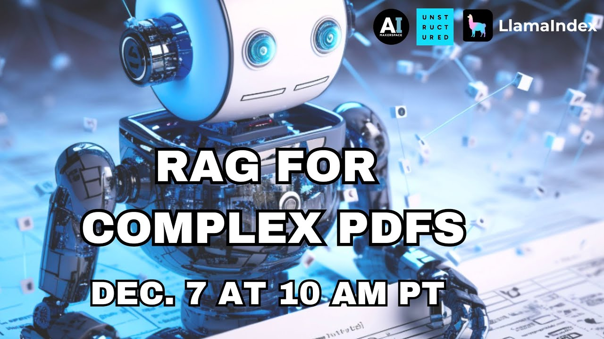

# LlamaIndex 🦙

LlamaIndex is a tool that bridges custom data and large language models, making data more accessible for creating custom applications and workflows. 

It assists in data ingestion, structuring, retrieval, and integration with various application frameworks. The system comprises data connectors to fetch data, data indexes for organization, and engines (LLMs) for natural language interaction. 

In practise, LlamaIndex excels at providing an easy way of connecting, ingesting and indexing information from different sources and formats. 

## Data Connectors 

These are a variety of data fetchers for diverse sources like APIs, databases, or PDFs. They are crucial in ensuring that your data, irrespective of its origin, is brought into the system for processing. You can find all classes of connectors and their implementations in [LlamaHub](https://llamahub.ai/): we are talking about Notion, Slack, json, google docs, markdown, s3 and much more.

## Data Indexes 

Once data is ingested, it needs to be organized. This is where data indexes come in, facilitating the transition from ingestion to an organized structure. One of the main points is that it allows you to create connections between your ingested pieces, for example indicating which chunk is the previous and next one in a sequence. It also has the advantage that it integrates with most VectorStore providers. As an example of this, we leave you with a quick introduction.

[Link to video](https://www.youtube.com/watch?v=WKvAWub8VCU)

## Building a Knowledge Base with LlamaIndex

Creating a knowledge base with LlamaIndex is simple and yhere are two main reasons to use this tool: first, how it eases and standardizes the procedure, allowing for easier integrations from different types of sources and easier migrations, like changing from a database provider into a new one; second, it adds extra structure/information to the database. Building a Knowledge Base can be divided into two stages:

- **Indexing Stage**: where you prepare your knowledge base by using data connectors to ingest data, see the [documentation](https://docs.llamaindex.ai/en/stable/understanding/loading/loading.html), which is then represented as Documents or Nodes. Documents are the base unit of information for LlamaIndex and these follow the same structure as LangChain's Documents and have some resemblence to the mongoDB ones too. To understand a bit more on what an index is, we refer you to [this documentation](https://docs.llamaindex.ai/en/stable/understanding/indexing/indexing.html).

- **Querying Stage**: This stage involves fetching relevant context from your knowledge base in response to queries. LlamaIndex querying capabilities are not just limited to basic data retrieval but encompass a comprehensive, [three-stage process](https://docs.llamaindex.ai/en/stable/understanding/querying/querying.html):
  1. _Retrieval_: This stage involves finding and returning the most relevant documents from the Index. The common method here is `"top-k"` semantic retrieval, but LlamaIndex supports various retrieval strategies​​.
  2. _Postprocessing_: In this phase, the retrieved Nodes are optionally reranked, transformed, or filtered. This could include applying specific metadata such as keywords to the Nodes, enhancing the relevance and precision of the retrieved information​​.
  3. _Response Synthesis_: The final stage involves combining the query, the most relevant data, and the prompt, which are then sent to the LLM to generate a response​

The querying process in LlamaIndex is highly customizable and you can read more about it [here](https://docs.llamaindex.ai/en/stable/understanding/querying/querying.html). Let us just mention a couple of things to bear in mind:

- **Custom Retrieval Configurations**: Users can customize the retrieval process, such as adjusting the number of top-k results and adding post-processing steps like minimum similarity score requirements for the retrieved nodes.
- **Advanced Node Postprocessing**: this includes options like filtering nodes by required and excluded keywords, setting thresholds on similarity scores, and augmenting nodes with additional relevant context based on Node relationships. This feature helps improve the relevancy of the retrieved Nodes, reducing the time and cost associated with LLM calls​
- **Flexible Response Synthesis Options**: the response synthesis stage can be configured to suit different needs. Options include creating and refining an answer by sequentially going through each retrieved Node (good for detailed answers), compacting the prompt during each LLM call (for fitting many Node text chunks within a maximum prompt size), tree summarization for creating a summary response, and an accumulate mode that applies the query to each Node text chunk separately​

[Link to video](https://www.youtube.com/watch?v=FQBou-YgxyE)

[Link to video](https://www.youtube.com/watch?v=oa82yoJ6zYc)
