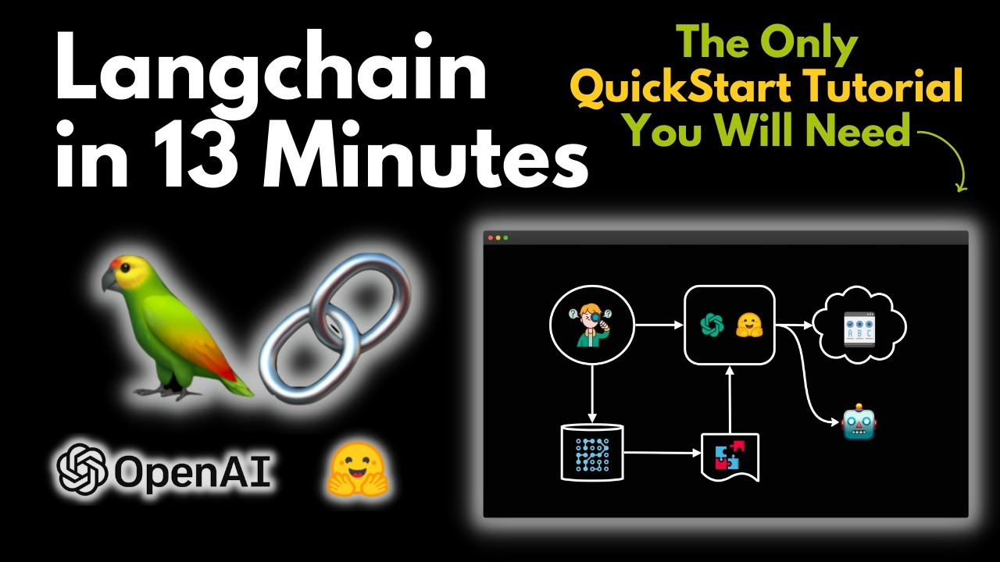
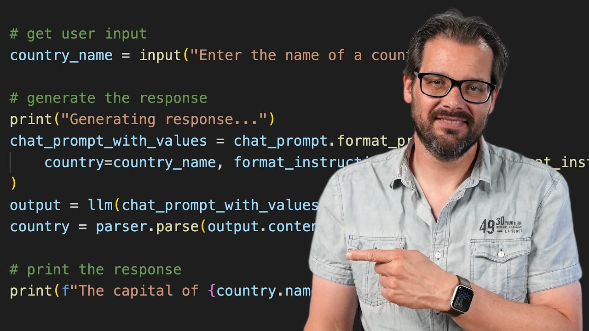
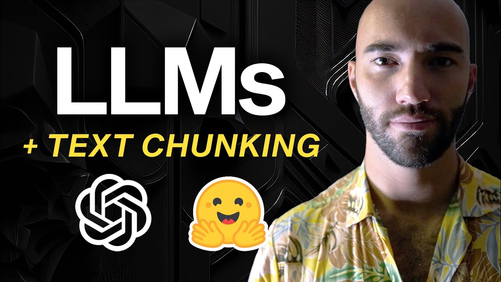
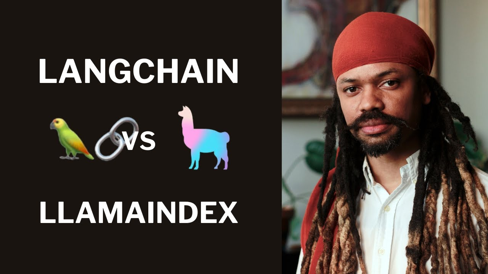

# LangChain 🦜

Langchain is a software library designed to facilitate the integration and usage of large language models, like OpenAI's GPT series, in applications and products. Its main purpose is to provide developers with a set of tools and frameworks that simplify the process of incorporating advanced natural language processing capabilities into their projects. Here's a brief overview of its structure and features:

## Chains 🔗

Langchain's structure is based around the concept of "chains", but it also incorporates several other components to enhance its functionality. 

- **Chains as the Core**: In Langchain, a "chain" refers to a sequence of components that process information in a step-by-step manner. Each component in a chain performs a specific function, such as interpreting input, generating responses, or refining content. Chains are modular, allowing for flexible combinations of different functionalities to suit various application needs.

- **Customizable Workflow**: Developers can customize chains to create specific workflows. For instance, a chain might start with a component that preprocesses input text, followed by a language model that generates a response, and then a postprocessing component that refines this response.

[Link to video](https://www.youtube.com/watch?v=aywZrzNaKjs)

[Link to video](https://www.youtube.com/watch?v=I4mFqyqFkxg)

## Agents 🤖

These might be the future of LLM applications, they are empowered parts of the LLM that have access to specific tools. They have a rival, function calling, that we will address in future references.

## Ingestion 🍽️

Langchain allows for the ingestion of large datasets or streams of data. This feature is crucial for applications that need to process and analyze significant amounts of information, such as chatbots that learn from previous interactions or content analysis tools. This is done via text splitters. The following video explains a bit about the possibilities of LangChain. 

[Link to video](https://www.youtube.com/watch?v=eqOfr4AGLk8)

## LlamaIndex 🦙 vs 🦜 LangChain

Even though LangChain can do everything LlamaIndex does, it does it a bit worse and it is less versatile regarding the number of methods. LlamaIndex is specialized on ingestion, indexing and querying as we saw on the previous model and it excels in comparison to LangChain. However, LangChain is more versatile and contains more powerful tools to build general applications. These are the Chains and Agents.

[Link to video](https://www.youtube.com/watch?v=8OiQcJdQjQI)