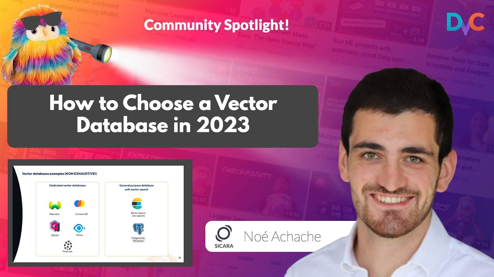
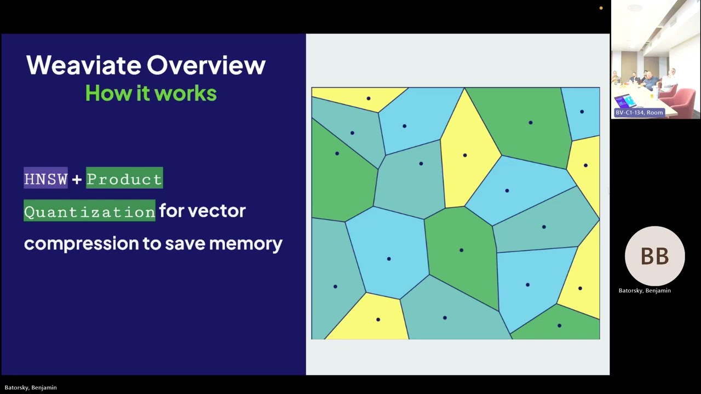

# Vector Databases  🗃️➡️

A Vector Database is a specialized type of database designed for handling vector data (information in high-dimensional space). These databases are optimized for operations like vector similarity search, which is essential for a wide range of applications like recommendation systems, image recognition, and Natural Language Processing.

Vector Databases are particularly ideal for applications requiring high efficiency in similarity search tasks (like finding the most similar images, documents, or audio files). This is because they excel at performing similarity and nearest-neighbor searches in high-dimensional spaces with specialized indexing and search algorithms.

The landscape of vector databases is evolving rapidly, with several options available on the market, each offering different features and optimizations. To get a comprehensive overview of some of the leading providers and their unique advantages, we recommend reading [this article](https://www.sicara.fr/blog-technique/how-to-choose-your-vector-database-in-2023).

Video version of the article:

[Link to video](https://www.youtube.com/watch?v=aX_hdQEintc)

Another video to consider is the following PyData session about Weaviate, where some of the main concepts behind Vector Databases are explained.

[Link to video](https://www.youtube.com/watch?v=9fMP-Ny4j4o)

Finally, we present to you an **optional** resource on Hierarchical Navigable Small Worlds (HNSW), one of the most commonly used techniques for doing similarity searches.

[Link to video](https://www.youtube.com/watch?v=QvKMwLjdK-s)
