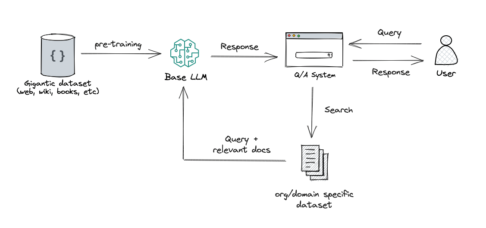

# Retrieval-Augmented Generation

One significant limitation of LLMs is that they can only access to their training data, so when the model generates an answer it can only draw upon information that existed at the time it was trained. With Retrieval-Argumented Generation (RAG), models can use a private database of up-to-date information to provide more informed and current responses.

The using of RAG solves several issues, but the most common are:
1. **Outdated training data**: some applications may require access to the latest information, such as current weather conditions, recent transactions, etc. This is not possible with static training data.
2. **No references for the answer**: we know that LLM's have the tendency to hallucinate (they can generate information that is not grounded in reality). Knowing the source of a response is fundamental for pinpoint these cases and verify the accuracy and reliability of the responses.

RAG is a very simple technique to understand: it consists on creating an augmented answer based on retrieved information. And how does this work? Now that you are familiar with indexation and ingestion, you know we have ways of associating an LLM-based entity, the embeddding, with chunks of text that constitute our sources. 

So, the most basic RAG is based on comparing a query (a question or request) to the most similar chunks of text. This way, we can retrieve the most relevant information from our knowledge base and provide it to the model in order to reply to this query. 

This whole process is done by two main components:
- The Retriever: searches a bunch of documents or a knowledge base to find the most relevant information that matches a query or prompt. This component is similar to how traditional search engines work, identifying the top-k documents or chuncks that are most likely to contain the answers.
- The Generator: once the relevant documents are retrieved, the generator (usually a language model like GPT) processes them to synthesize a coherent response. The LLM uses the retrieved content as a grounding mechanism to produce the text.

The following video provides a simple but very comprehensive explanation of the basic concepts of RAG:

[What is RAG?](https://www.youtube.com/watch?v=aywZrzNaKjs)

## RAG STRUCTURE DIAGRAM

In summary, by using RAG, developers can build more reliable, accurate, and context-aware LLM applications. This technique helps to generate responses based on up-to-date, relevant information form external sources, enhancing user experience and trust.

In a following section we will explore how LLM models can use tools to retrieve extra information, expanding their capabilities.
