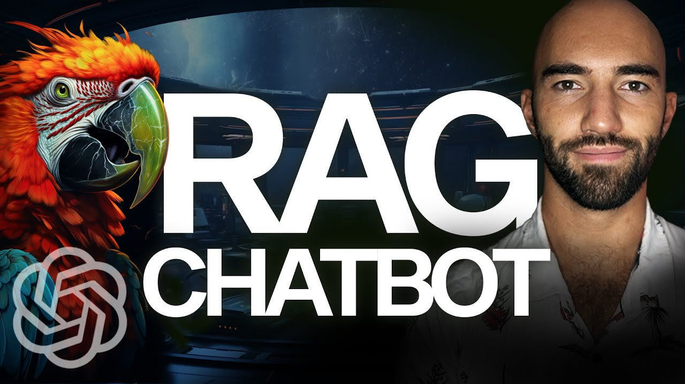

# Applications

Most of the applications for LLMs are, of course, chatbots. However, the limit is creativity and architecture. You can envision a _plethora_ of implementations based on this technique. We will give a couple of examples.

## A note on LangChain 🦜

We come back to LangChain and again!
Again, we want to stress that this tool is in no form necessary. It just gives you an easy and fast way to implement a basic structure. It comes with some issues:
- It is not easy to personalize
- At the current time (december 2023), it keeps on adding new versions and every couple of months updating to a newer version is annoying
- It can give versioning conflicts with other tools, mainly with respect to openAI version requirements.

But let us show you a simple implementation of a RAG chatbot using LangChain:

[Link to video](https://www.youtube.com/watch?v=LhnCsygAvzY)

## Chatbots 🤖💬

Even though we have already mentioned this on the video above, we can create a sequence of chains (if in LangChain) or processes to create a more efficient and safe chatbot. The architecture of the chatbot might include:

- **Summarization**: what has been the conversation about so far untill now
- **Intent recognition**: is the question asked by the user legit? Is the user trolling or insulting the chat? Is the user trying to force the chatbot into providing him with sensitive answer / information?
- **Topic recognition**: what is the topic of the user's question? (this will help with information retrieval)
- **Language recognition**: what is the language of the question?
- **Safe replies**: are the chunks of information relevant to answer the question?
- **Source retrieval**: if using a knowledge base as a reference, what are the sources used to build the answer?

## Summarization and Information extraction

Another huge set of possible application/s entails summarization and information extraction. Basically, it means using an LLM to either summarize or extract relevant information from huge texts. Let us provide a couple interesting implementations:

- **Call summarization**: you can transcript a call with a speech-to-text tool and then ask an LLM to provide a summary of the interaction.
- **Call information extraction**: likewise, you could ask the LLM to fill out a form summarizing the interaction: caller's name, identifying number, address, issue, comments, etc.
- **Document information extraction**: you could ask the model to extract for you specific entities from a document. For example, you could envision a system in which freelancers or companies uploads all the relevant financial documents for the year and the system automatically generate the corresponding yearly fiscal declaration or quarterly VAT declarations. 
- **Automatic reports via audio**: imagine a use-case where suppliers or other type of workers need to fill in daily reports or forms on different transactions. Having the possibility of simply describing the details to a cell phone immediately after the event increases accuracy and performance. 

## Copilots

This is a secondary form of chatbots. The idea is not directly talking to the user, but assisting during the interaction. 

## Final thoughts

All these applications can be enhanced by further capabilities. Some solutions may trigger different internal processes, like a customer asking to change his address, or a chatbot asking relevant information to fill out a form, maybe during a call or a chat, etc.

As said, possibilities depend only on imagination and building good software architecture. 

> Note: A good way of ensuring good architecture is to take a look at [DareData's Foundations Learning Pod](https://github.com/DareData/lp-foundations), where we discuss best practices for writing high-quality and scalable code in a collaborative environment. 