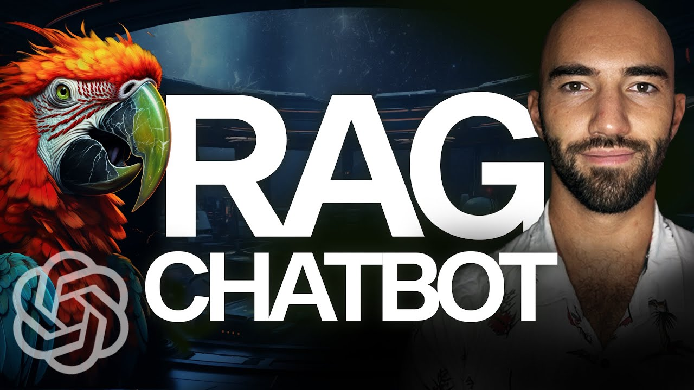

## Implementing RAG

Following the two videos shown in the previous section, where the basic concepts of RAG and the detailed steps of implementing a RAG system were explained, this section will explore various ways to implement this method in your projects. The main goal of this RAG implementations is to enhance the LLMs performance by integrating external information to generate better responses.

## Implementing RAG in LangChain and LlamaIndex

Both of this libraries are not extremely necessary to use RAG, they are just tools that can provide an easy and fast way to implement the basic RAG structure.

### Langchain  🦜
Leverages its modular architecture of chains and agents to integrate retrievers and generators effectively. A chain can be created where the first step retrieves relevant information from a vector store or a database, and the second step generates a response based on the retrieved information.

However, this technique comes with some issues:
- It is not easy to personalize
- At the current time (december 2023), it keeps on adding new versions and every couple of months updating to a newer version is annoying
- It can give versioning conflicts with other tools, mainly with respect to openAI version requirements.

The next video shows a simple implementation of a RAG chatbot using LangChain:



[Link to video](https://www.youtube.com/watch?v=LhnCsygAvzY)


### LlamaIndex 🦙
Specialized in building and managing indices, LlamaIndex makes it easy to create a robust retriever system using various data connectors and indexing methods. You can implement a RAG pipeline by connecting a custom retriever that fetches relevant documents and then uses an LLM to generate the final output.

## Example of connecting a basic Chatbot to a Knowledge Base using RAG

In this final part, we want to show a piece of code that demonstrates how you can enhance a chatbot's performance using RAG. Basically, we are adding retrieval argumentation to a simple chatbot that was build initially and cannot answer a given question. This chatbot doesn’t have access to the needed information and may respond wrongly or even hallucinate.So we need to "feed" it with new information (apart from the one that was given when the model was trained), by connecting it to an external knowledge base, to obtain a more accurate and correct answer.

The steps of this process:
1. Build a simple chatbot without any retrieval argumentation
2. This chatbot is not able to answer certain questions because it doesn't contain the needed information. In this case, the chatbot can admit that doesn't know the answer, or it can respond like it "does" know the answer (hallucination).
3. Create a knowledge base with the information that you want to provide to your chatbot
4. Connect this knowledge base to the chatbot using a retrieval mechanism. There are various ways and techniques to do it, in this case we'll show you a langchain implementation.

To simplify the things, we are just showing the piece of code related to the conection between the database and the chatbot - basically the way that the chatbot "grab" the information and then is use it to answer the question.

Here's the code:

```python

# Define the text field that will be searched in the vector store (in this case, 'text')
text_field = "text" 

# Initialize the Pinecone vector store, passing the index, embedding model for querying and the field where the data is stored in the vectorstore
vectorstore = Pinecone(
    index, embed_model.embed_query, text_field
)

# Define the user query
query = "<your question>"

# Perform a similarity search in the vector store using the query, retrieving the top 3 relevant results
vectorstore.similarity_search(query, k=3)

# Function to augment the query by including relevant retrieved information - the LLM parse this infomation
# by connecting the output from the vectorstore to the chatbot
def augment_prompt(query: str):
    # Perform a similarity search to retrieve relevant chunks of text
    results = vectorstore.similarity_search(query, k=3)
    # Get the text from the results by concatenating the content of the retrieved results
    source_knowledge = "\n".join([x.page_content for x in results])
    # Format the augmented prompt by adding the retrieved knowledge
    augmented_prompt = f"""Using the contexts below, answer the query.

    Contexts:
    {source_knowledge}

    Query: {query}"""
    return augmented_prompt

print(augment_prompt(query)) # => OUTPUT


# Create a HumanMessage to include the augmented prompt in the conversation with the LLM
prompt = HumanMessage(
    content=augment_prompt(query)
)
# Append the augmented prompt to the list of messages that the LLM will process
messages.append(prompt)

# Pass the messages (including the augmented prompt) to the LLM to generate a response
res = chat(messages)

print(res.content) # => OUTPUT

```

In conclusion, this example demostrates how to integrate RAG in a simple chatbot, and how this integration enables the chatbot to provide well-informed responses. The differences between the answers of a simple chatbot and a RAG enhanced version are significant, as the second one uses the knowledge stored in a database to generate a real information based answer.
