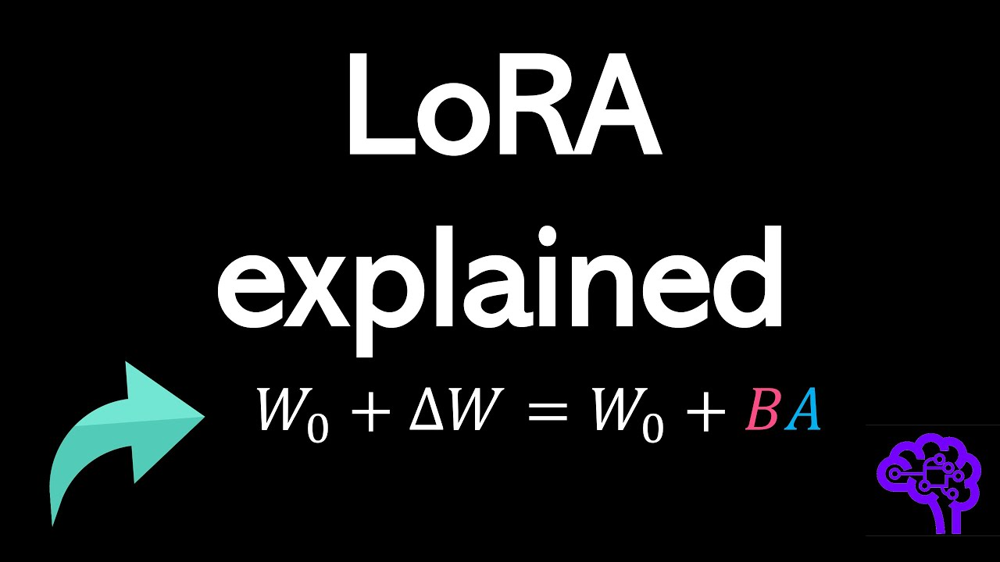
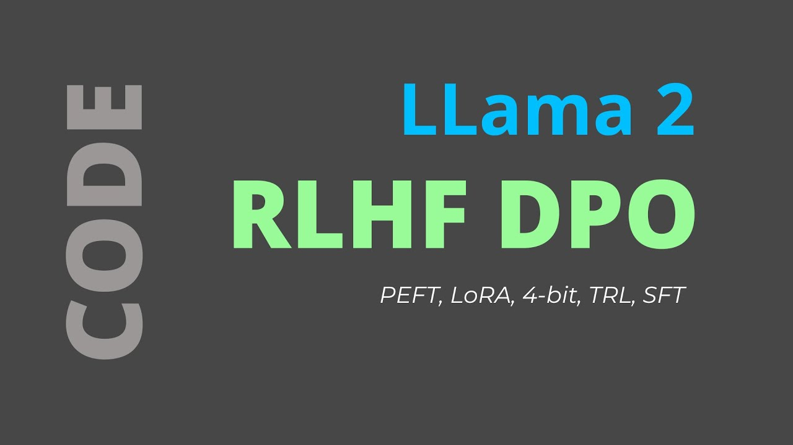

# Fine-tuning 📻

As we said, fine-tuning is the process of adapting a pre-trained existing model to perform a specific task or work in a particular domain, by training it on a smaller and specialized dataset. This method allows the model to retain its general understanding from the initial training while is being trained "again" to focus on a specific context. Fine-tuning is highly effective for customizing general-purpose models into task-specific ones.

In some cases, RAG might not be sufficient... particularly for domains that require highly technical and specialized language, such as legal, business analytics, or medical fields. That’s where fine-tuning comes in!

## How Fine-Tuning Works

In fine-tuning, the pre-trained model undergoes additional training on a smaller dataset that is specifically related to the target task or context. This further training refines the model's weights, helping it to focus on patterns and information that are specific to this new dataset.

There are several approaches for appplying and implementing fine-tuning in pre-trained models. These different fine-tuning methods offer flexibility, allowing developers to choose the most suitable approach depending on the model's size, the available resources, and the specific use cases.

In this file we'll show you some of this techniques, describing how they work and explaining their peculiarities.

The techniques that will be presented are:

1. Instruction Tuning
2. Parameter-Efficient Fine-Tuning (PEFT)
 2. 1. Low-Rank Adaptation (LoRa)
 2. 2. Quantized Low-Rank Adaptation (QLoRA)

3. Reinforcement Learning with Human Feedback (RLHF): A fine-tuning method that incorporates feedback from humans to align the model's outputs with human preferences and values.
4. Fine-Tuning OpenAI Models: Customizing pre-trained models from OpenAI, such as GPT-3, for specific tasks using specialized datasets.

## 1. Instruction Tuning

Instruction tuning is a technique for fine-tuning large language models (LLMs) using a labeled dataset of instructional prompts and their corresponding outputs. In this method, the mechanism is to use examples that demonstrate how the model should respond to specific queries. For example, if you want the model to translate in a specific way, you should build up a dataset of examples with prompts like `Translate the following into <language>`, followed by the text to be translated. These prompt-completion pairs allow the model to "think" in a specialized way yo perform a specific task.

The key point in this technique lies in the data used to train the model. While standard fine-tuning typically involves training models on input-output pairs (e.g., text and its label), while instruction fine-tuning introduces an additional component: instructions.

By training on instruction-augmented datasets, models can generalize more easily to new tasks. LLMs tuned in this way become more versatile because the instructional prompts help the model transfer its pre-trained knowledge to new tasks more effectively.

Instruction tuning improves model performance not only on specific tasks but also on following instructions in general, helping adapt pre-trained models for practical use cases. However, this method is not highly recommended since it is computationally heavy and costly.

## 2. Parameter-Efficient Fine-Tuning (PETF)

Training a language model is a process that demands extensive computational resources. It involves not just storing the model itself but also accommodating various parameters essential for training. Although your computer might manage the model's weights, the real challenge lies in allocating memory for optimizing states, gradients, and forward activations during training. Basic hardware often falls short in handling these requirements.

This is where Parameter-Efficient Fine-Tuning (PEFT) presents itself as a viable alternative. PEFT selectively updates a limited subset of parameters, adopting a transfer learning approach, where specific parts of the model are actively modified, and the rest are "frozen", remaining unchanged. Consequently, this leads to a significant reduction in the number of parameters - sometimes just 1-20% of the original model's weights. 

Moreover, PEFT addresses the issue of catastrophic forgetting. Since it leaves the original LLM largely untouched, the model retains its previously learned information. 

There are two main techniques depending on the amount of computation capacity that you have: LoRA and QLoRA.

The following video discusses about fine-tuning, the different ways to implement it, and explains the basics of LoRa. It also provides an example of how to fine-tune a LLM using LoRa for a better performance of the model.

The example uses the Hugging Face ecosystem, working with very popular libraries such as Transformers, Datasets or PEFT. Hugging face is well-known for this open-source libraries and tools that have democratized access to AI models, amaking them the most used resources to implement fine-tuning. We'll dive into this ecosystem in the next section, but is important to introduce it here, since is going to be the key tool used in all the examples for each fine-tuning technique presented in this file.

[Link to video](https://www.youtube.com/watch?v=eC6Hd1hFvos)

### 2. 1. Low-Rank Adaptation (LoRa)

Low-Rank Adaptation (LoRA) is a fine-tuning mechanism that is based on adding new trainable parameters on top of an existing model. There are two main concepts in LoRA

- **Low-Rank Matrix**: LoRA introduces a concept of low-rank matrices to modify the existing weights of a neural network. In linear algebra, a low-rank matrix is one where the rank (the maximum number of linearly independent column vectors in the matrix) is less than the maximum possible.
- **Adaptation** without Full Retraining: Instead of retraining the entire network, LoRA adapts only a small set of parameters. This is done by adding low-rank matrices to key weights in the model’s layers (usually the attention and feedforward layers in transformer models).

So how does it work?

- **Insertion of Low-Rank Matrices**: During the adaptation phase, LoRA inserts trainable low-rank matrices into the model. These matrices are much smaller in size compared to the original model weights.
- **Modification of Weights**: The original weights of the model are not directly modified. Instead, the output of these low-rank matrices is used to adjust the activations within the model, effectively altering its behavior.
- **Task-Specific Tuning**: The low-rank matrices are trained on the specific task or data, allowing the model to adapt to new requirements with minimal changes to its overall structure.

In summary, LoRA is a sophisticated and efficient technique for adapting large pre-trained language models to new tasks or domains, ensuring both computational efficiency and the preservation of the model's extensive pre-trained knowledge.

First, let us discuss a bit about the basics of the method. The following video explain the core ideas of LoRa and introduces the concepts of Precision and Quantization.

[Link to video](https://www.youtube.com/watch?v=t509sv5MT0w)

And now an extended version with implementation code from HuggingFace

[Link to video](https://www.youtube.com/watch?v=YVU5wAA6Txo)

### 2. 2. Quantized Low-Rank Adaptation (QLoRA)

We have already seen a bit about Quantization in the previous theoretical video. The idea is that LLMs are so memory intensive, and training them typically requires distributing computations across several GPU units. We have already seen how LoRA can help in this regard, but there is technique that allows us to go even further. 

Bassically, QLoRA is an extension of the LoRa technique, designed to make LLMs even more efficient by combining this low-rank adaptation with quantization. Quantization reduces the precision of the model's weights, which significantly decreases memory and computational requirements, while low-rank adaptation ensures that the fine-tuning process remains focused on adapting only a subset of the model's parameters. Together, these two methods allow for high-quality model performance with much lower resource requirements.

So, in summary, by sacrifizing precision, we can change the weight storage from traditional 32-bits to 16-bits and we would keep decent results while halving the storage space needed. Going further means losing even more precision, giving lighter versions of the model. The precision-memory balance can be optimized by quantizing these floats. This technique allows us to go from 32-bit representations to mere 4-bit integers! This means one could fine-tune huge LLMs on basic computer GPUs!

The following video delivers a detailed explanation QLoRA 4bit Quantization for memory efficient fine-tuning of LLMs.

[Link to video](https://www.youtube.com/watch?v=TPcXVJ1VSRI)

## 3. Reinforcement Learning with Human Feedback (RLFH)

Reinforcement Learning with Human Feedback (RLHF) is a specialized method used in the training and refinement of LLMs. It focuses on incorporating human input into the learning process to improve the model's ability to align with human preferences, expectations, and values.

RLHF integrates this human data directly into the model's training cycle:
Initially, the model is trained with a traditional dataset, like in supervised learning. After this, it undergoes a reinforcement learning phase, where it receives human feedback on its outputs to further refine its responses. 

Human feedback, such as ranking outputs using a thumbs-up or thumbs-down system, is integrated to refine the reward model. The reward model maps input text sequences to scalar values, indicating how well the model aligns with human preferences. This phase involves specific datasets composed of prompt and reward pairs.

Finally, once the reward model is trained, techniques like Kullback-Leibler (KL) divergence and Proximal Policy Optimization (PPO) are used for fine-tuning the LLM to generate more appropriate responses based on user prompts.

For implementing RLHF in Python, there are several libraries and tools available:

- Transformers Reinforcement Learning (TRL): designed for fine-tuning pretrained language models in the Hugging Face ecosystem with PPO.

- TRLX: An extended fork of TRL. Built to handle larger models for online and offline training, capable of production-ready RLHF with PPO and Implicit Language Q-Learning (ILQL).

- Reinforcement Learning for Language models (RL4LMs): Offers building blocks for fine-tuning and evaluating LLMs using various RL algorithms, reward functions, and metrics. It supports a range of transformer-based models.

- NeMo-RLHF: a NVIDIA's library for fine-tuning LLMs using RLHF in a distributed manner, specifically supporting GPT models and implementing the PPO algorithm.

[Link to video](https://www.youtube.com/watch?v=aI8cyr-gH6M)

## 4. Fine-tuning OpenAI

Some providers may allow you to fine-tune their models in an easy way. And this is the case of OpenAI. You only need to follow a couple of instructions to preprocess your data and send them the corresponding files. After that you'll have your fine-tuned ChatGPT, yey! 

For most cases (at December 2023), the costs to build a model like this and use it in production are too much, so RAG is normally favored for many use cases. 

[Link to video](https://www.youtube.com/watch?v=MkocIPcg5A8)
