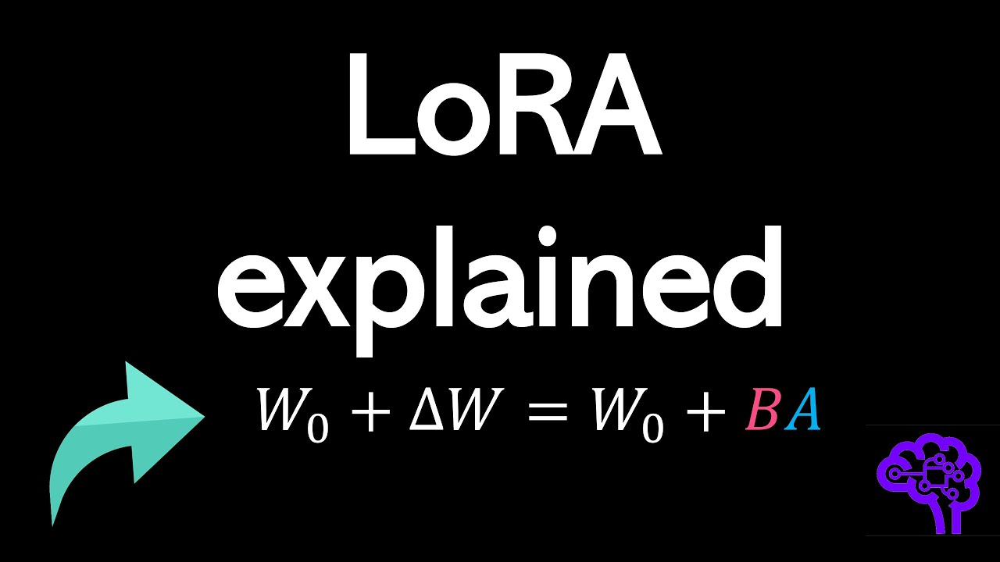
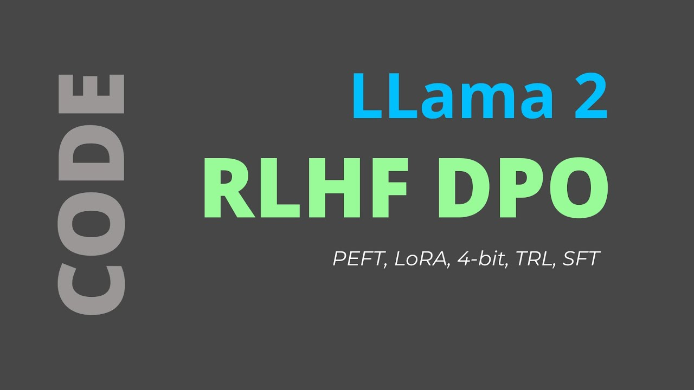

# Fine-tuning 📻

There are some particular use-cases for which RAG might not be enough. You could think of very technical intrincate language such as legal, business analytics or even medical. Introducing... fine-tuning!

## Instruction fine-tuning

This is the most direct approach and it is not recommended since it is very computationally heavy and costly. In this scenario, we train the machine learning model using examples that demonstrate how the model should respond to the query. For example, imagine you want the model to translate in a specific way. In that case, you should build up a dataset of examples that begin with the instruction to translate like `Translate the following into <language>`, followed by text or a similar phrase. These prompt completion pairs allow your model to "think" in a new niche way and serve the given specific task.

## Parameter-Efficient Fine-Tuning (PETF)

Training a language model is a process that demands extensive computational resources. It involves not just storing the model itself but also accommodating various parameters essential for training. Although your computer might manage the model's weights, the real challenge lies in allocating memory for optimizing states, gradients, and forward activations during training. Basic hardware often falls short in handling these requirements.

This is where Parameter-Efficient Fine-Tuning (PEFT) presents itself as a viable alternative. PEFT selectively updates a limited subset of parameters, adopting a transfer learning approach, where specific parts of the model are actively modified, and the rest are "frozen," remaining unchanged. Consequently, this leads to a significant reduction in the number of parameters - sometimes just 1-20% of the original model's weights. 

Moreover, PEFT addresses the issue of catastrophic forgetting. Since it leaves the original LLM largely untouched, the model retains its previously learned information. 

There are two main techniques depending on the amount of computation capacity that you have: LoRA and QLoRA

[Link to video](https://www.youtube.com/watch?v=eC6Hd1hFvos)

## Low-Rank Adaptation (LoRA)

Low-Rank Adaptation (LoRA) is a fine-tuning mechanism that is based on adding new trainable parameters on top of an existing model. There are two main concepts in LoRA

- **Low-Rank Matrix**: LoRA introduces a concept of low-rank matrices to modify the existing weights of a neural network. In linear algebra, a low-rank matrix is one where the rank (the maximum number of linearly independent column vectors in the matrix) is less than the maximum possible.
- **Adaptation** without Full Retraining: Instead of retraining the entire network, LoRA adapts only a small set of parameters. This is done by adding low-rank matrices to key weights in the model’s layers (usually the attention and feedforward layers in transformer models).

So how does it work?

- **Insertion of Low-Rank Matrices**: During the adaptation phase, LoRA inserts trainable low-rank matrices into the model. These matrices are much smaller in size compared to the original model weights.
- **Modification of Weights**: The original weights of the model are not directly modified. Instead, the output of these low-rank matrices is used to adjust the activations within the model, effectively altering its behavior.
- **Task-Specific Tuning**: The low-rank matrices are trained on the specific task or data, allowing the model to adapt to new requirements with minimal changes to its overall structure.

In summary, LoRA is a sophisticated and efficient technique for adapting large pre-trained language models to new tasks or domains, ensuring both computational efficiency and the preservation of the model's extensive pre-trained knowledge.

First, let us discuss a bit about the basics of the method.

[Link to video](https://www.youtube.com/watch?v=t509sv5MT0w)

And now an extended version with implementation code from HuggingFace

[Link to video](https://www.youtube.com/watch?v=YVU5wAA6Txo)

## Quantized Low-Rank Adaptation (LoRA)

We have already seen a bit about quantization in our previous theoretical video. The idea is that LLMs are so memory intensive, that training them in GPUs means parallelizing the computation across several GPU units. We have already seen how LoRA can help in this regard, but there is technique that allows us to go even further.

By sacrifizing precision, we can change the weight storage from traditional 32-bits to 16-bits and we would keep decent results while halving the storage space needed. Going further means losing even more precision, giving lighter versions of the model. 

The precision-memory balance can be optimized by quantizing these floats. This technique allows us to go from 32-bit representations to mere 4-bit integers! This means one could fine-tune huge LLMs on basic computer GPUs!

[Link to video](https://www.youtube.com/watch?v=TPcXVJ1VSRI)

## Reinforcement Learning with Human Feedback (RLFH)

This is a distinct method used in the training and refinement of Large Language Models (LLMs), focusing on incorporating human feedback into the learning process.

RLHF integrates human feedback directly into the training process. This feedback guides the model in understanding and aligning with human preferences, expectations, and values.

With this human data, we train a reward model. This model acts as an alignment tool, mapping input text sequences to scalar reward values. It is trained using specific datasets composed of prompt and reward pairs.

Human feedback, such as ranking outputs using a thumbs-up or thumbs-down system, is integrated to refine the reward model.
In RLHF, the model is initially trained with a dataset (like in traditional supervised learning). Then, it undergoes a process of reinforcement learning where it receives feedback on its outputs.

To incorporate human preferences, additional data is required, often involving human-generated responses to prompts.

Finally, techniques like Kullback-Leibler (KL) divergence and Proximal Policy Optimization (PPO) are used for fine-tuning the LLM to generate more appropriate responses based on user prompts.

For implementing RLHF in Python, there are several libraries and tools available:

- Transformers Reinforcement Learning (TRL): TRL, designed for fine-tuning pretrained LMs in the Hugging Face ecosystem with PPO.

- TRLX: An expanded fork of TRL built to handle larger models for online and offline training, capable of production-ready RLHF with PPO and Implicit Language Q-Learning (ILQL).

- Reinforcement Learning for Language models (RL4LMs): Offers building blocks for fine-tuning and evaluating LLMs with various RL algorithms, reward functions, and metrics. It supports a range of transformer-based LMs.

- NeMo-RLHF: A library by NVIDIA for fine-tuning LLMs using RLHF in a distributed manner, specifically supporting GPT models and implementing the PPO algorithm.

[Link to video](https://www.youtube.com/watch?v=aI8cyr-gH6M)

## Fine-tuning OpenAI

Some providers may allow you to fine-tune their models in an easy way. This is the case of OpenAI: you only have to follow a couple of instructions to preprocess your data and send them the corresponding files and you would have your fine-tuned ChatGPT, yey! For most cases (at December 2023), the costs to build a model like this and use it in production are too much and RAG is normally favored. 

[Link to video](https://www.youtube.com/watch?v=MkocIPcg5A8)
