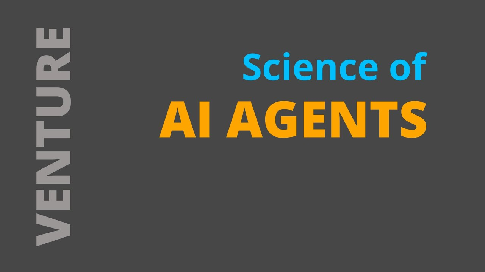
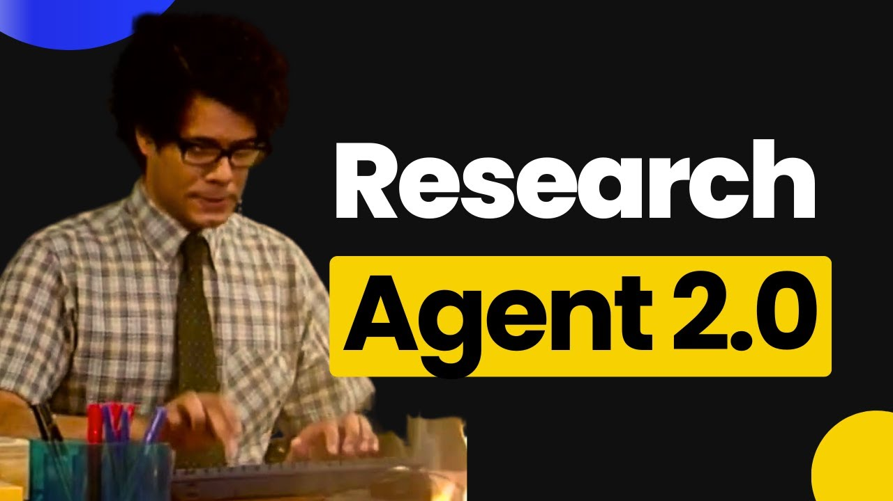
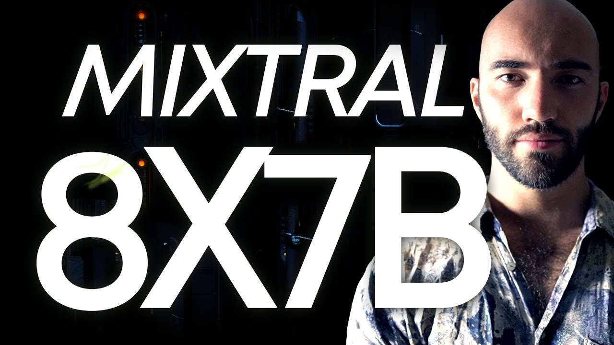
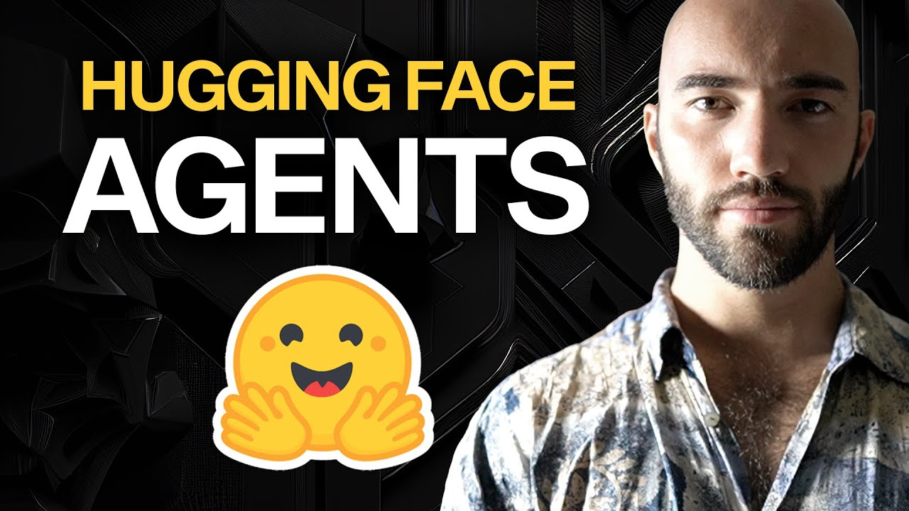

# Agents 🕵️

So we have reached one of the most flexible concepts in the realm of LLMs: agents. So what are agents? 

They are functions the LLM has access to in order to reply to user's questions / queries. An example of this might be a Wikipedia agent, that allows the model to search the key parts of a query or an internet search that allows the model to extract the first searches in the internet. This is a very basic one, but imagine a chatbot that can ask you for your credentials to acess your data and give you personalised answers.

[Link to video](https://www.youtube.com/watch?v=pVwk29B6q_8)

## LLM agents

The idea is then to inform the model what types of tools it has access to and allow the model to receive the answer from said tools. This is game-changer for complex and versatile implementation. In here, we leave you with two examples

[Link to video](https://www.youtube.com/watch?v=ogQUlS7CkYA)

and some open-source version

[Link to video](https://www.youtube.com/watch?v=aCRvIPpFyEI)

## An example: Hugging Face Agents

[Link to video](https://www.youtube.com/watch?v=-xAeqi_2cis)
