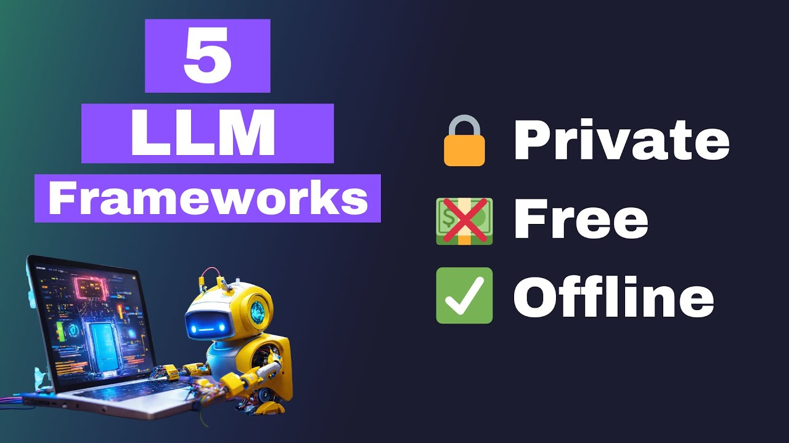

# Local Deployment for LLMs 🏠

When dealing with Large Language models, we have mainly seen how to use their APIs to send requests and receive their replies. We have seen that for fine-tuning we have several options: either host the fine-tuning online somewhere or doing it locally. In this section, we think of the cons and pros of hosting open-source LLMs ourselves.

## Cons
Let us first give you the bad news:

- Best performing LLMs today (at December 2023) are not open-source, so you will get worse answers.
- Best performing open-source LLMs are huge for most common computers (70GB models like Llama-2-70b requires 140GBs of VRAM)
> Note: you have already seen how quantization can help reduce by 8 the computational requirements, although this means losing quality.
- The latter point means that in order to have decently performing models you will need robust infrastructure.

## Pros
- 100% control on how your data is being treated.
- After buying the proper infrastructure, it is free.
- You don't depend on an internet connection.

## In practice

There are several frameworks one can explore. Most of them can be used for proof of concept projects, but when building infrastructure, the only really useful framework is again LangChain. This is because every use-case will mean a minimum of structure. Nonetheless, other tools are much simpler to build and can help when checking if a project is viable or not. 

[Link to video](https://www.youtube.com/watch?v=5WCvGyPpWwg)
