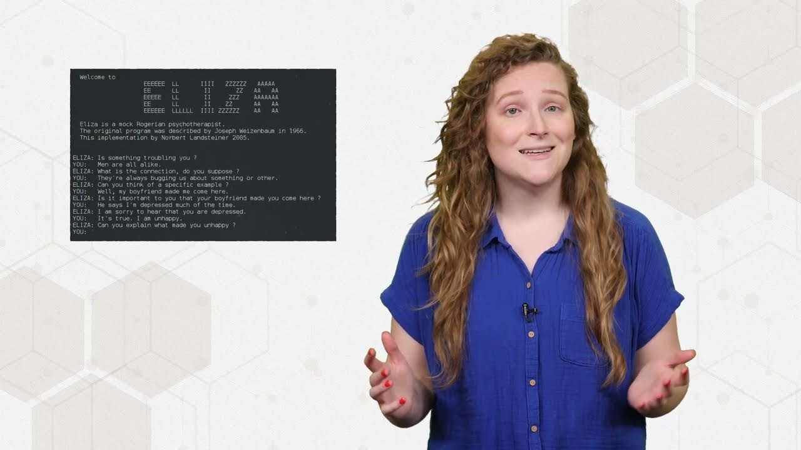

# Large Language Model Specialization

Welcome to the LLM especialization 🎉!

In here you will find all the information you need to know about organization in this course. This includes some introduction to the topic, a suggested learning calendar and two small sections on guidelines for both mentors and students.

## What is a LLM?

At their core, LLM's are gigantic neural networks with special types of architecture that have been trained for long periods of time. For example, original chatgpt had around 7 billion parameters 🤯. But not only are they big, but also trained in enormous amounts of data, in the petabyte scale.

[Link to video](https://www.youtube.com/watch?v=zKndCikg3R0)

## Suggested learning calendar

> **Note**: This is just a suggestion. Groups are encouraged to set their own deadlines with their mentors.

Week 01 _(~3.5 hours)_

- LLM basics

Week 02 _(~3 hours)_

- Prompt engineering

Week 03 _(~2.5 hours)_

- Indexation and ingestion

Week 04 _(~3 hours)_

- RAG

## Learning Structure

Students are to be divided into groups of 3. These groups should try to progress through the learning process together so that their questions and discussion are on the same wavelength. Each group will be assigned a mentor and will perform code reviews together.

**Mentors**: A mentor is a more experienced collaborator and/or someone who has already gone through the course. They are in charge of helping their group, answering questions and preventing them from being stuck, as well as keeping track of their progress.

## Expectations

### Expectations for students

Although we understand that time may be constrained, each student has responsibilities with its groups, namely.

- Try to keep the pace with the group's progress, neither falling too behind or advancing too much by themselves.
- Be courteous and respectful to your peers and mentor.
- Set your progress expectations with your mentor.
- Conduct yourself with integrity and honesty.

### Expectations for mentors

A mentor are tasked in ensuring their peers become better professionals, as such, we expect them to:

- Reserve at least 30 minutes per week for each group you mentor, for answering questions and giving feedback.
- Encourage group members and communicate openly.
- Be courteous and respectful to your mentees.
- Ensure code reviews go smoothly: oversee and help, but don't overtake the reviewer's responsibilities.
- Keep track of questions and progress of the group members (see [Progress tracking](#progress-and-questions-tracking))
- Conduct yourself with integrity and honesty.

## Progress and Questions Tracking

In order to help mentors in tracking the progress of their groups, we suggest using the following template:

- [Progress  Question Tracking template](https://docs.google.com/spreadsheets/d/1nODnLBLCcC6Dqe_pK_bog-BA78E9AuUq1l4S81Px61w/edit?usp=sharing)

Tracking questions is important so that we can improve the quality of the selected material, as well as create new ones.

## Pre-requisites

In order to make the best use out of this learning path, you should know:

- Basic / Intermediary Python: control flow, functions, handling errors, data structures, files, virtual environments, data manipulation libraries.

- Basic Machine Learning knowledge: what is a Machine Learning model, classification and regression models, common metrics for each problem, sci-kit learn.